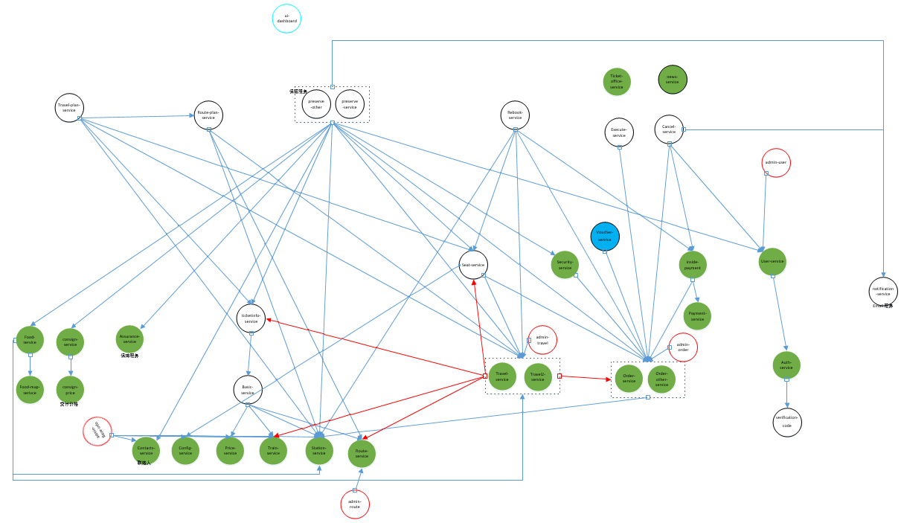

## 复旦火车票系统(此份之未原系统上增加 mclientframework——hit编程框架-微服务共享数据库)
原系统[train ticket](https://github.com/FudanSELab/train-ticket)

系统的理解等一些方面，逻辑图：

其余的见[smell定义中](http//60.205.188.102:8080/issue/MCS-87)
### 在原有的系统上进行一些更改

1. 基础镜像的更改：

   将原有的基础镜像**java:8-jre**更改为**openjdk:8-jre-alpine**

   原本的系统只每个服务只部署一个实例（在他的master节点的qui部署下）

2. 数据更改
3. 此分支添加编程框架，以便使用

### 项目运行：